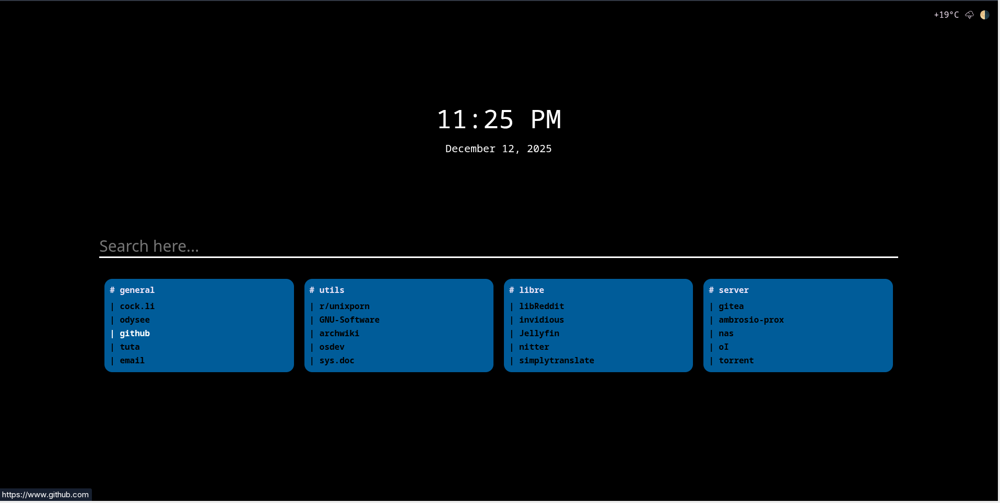

# Start Page 


>Uma página incial para navegadores de internet




### Fucionalidades

1. Links favoritos.
2. Direcionamento para sites como youtube, github.
3. Fazer pesquisas em buscadores alternativos.
4. Autocomplete.
5. Abertura de links amigaveis, complexos e locais na barra de pesquisa.

#### Como utilizar 

``` bash

    # Para rodar em localhost o servidor node usando seu usuário sem root.
    pacman -S setcap 

    sudo setcap 'cap_net_bind_service=+ep' /usr/bin/node

    git pull https://github.com/aou-aou/startpage 

    cd startpage
    
    npm install
    
    node server 

```

#### Como pequisar 

No momento e reconhecido os buscadores:

    - DuckDuckDuckGo
    - Google
    - StartPage
    - LibreY

Ao fazer uma pesquisa simples por padrão sera chamado o DuckDuckGo,
caso queira fazer pesquisas em outros buscadores digite o nome do buscador
na barra de pesquisa, siga os exemplos abaixo:

* DuckDuckGO -  du sua pesquisa aqui
* Google - go sua pesquisa aqui
* LibreY - ly sua pesquisa aqui
* StartPage - sp sua pesquisa aqui

Caso queira adicionar outros buscadores 
edite o arquivo [opener.js](public/home/js/miniEngine/opener.js#L83) .

Para mais direcionamentos de instâncias
edite o arquivo [opener.js](public/home/js/miniEngine/opener.js#L7) .

Para alias de serviços 
edite o arquivo [opener.js](public/home/js/miniEngine/opener.js#L27) .

